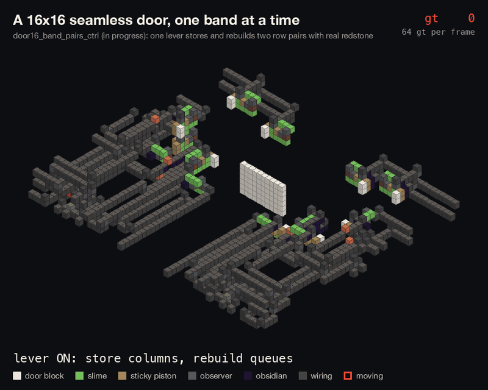
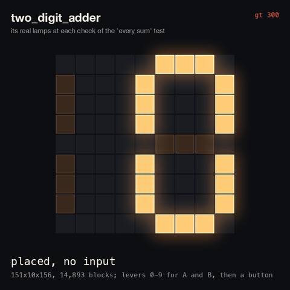
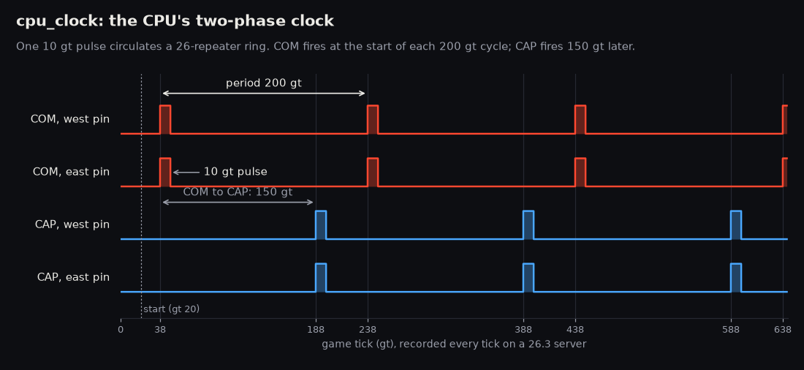

# Claudestone

**Vanilla Minecraft redstone, designed by Claude agents, proven tick by tick on a real server, shipped as a data pack.**

<p align="center">
  
</p>

<p align="center"><sub>
Two row pairs of our 16x16 seamless door (<code>door16_band_pairs_ctrl</code>, in progress) on one lever, with no command
stand-ins. Slime-block flying machines carry the quartz columns out into stacks, rebuild the queues and put every
block back where it was placed. Drawn from the real block types captured during the library test on a 26.3 server;
one frame per 64 gt opening and per 8 gt closing; the stone and repeater wiring is dimmed.
</sub></p>

> **From a sentence to a tested, paste-able build.** Claude agents design the redstone, a harness steps it one
> game tick at a time on an unmodified Minecraft Java 26.3 server, and only builds that pass ship, as a data pack
> that places exactly the blocks that were tested. Not a mod.

| At a glance (tracked files, 2026-10-01) | |
|---|---|
| **435** specs in **41** building-block folders, every one with its own tests | [`library/INDEX.md`](library/INDEX.md) |
| **84** specs that each prove one 26.3 mechanic | [`docs/MECHANICS.md`](docs/MECHANICS.md) |
| **27** community designs rebuilt as `ref_*` specs, so comparisons are measured, not quoted | `library/*/ref_*` |
| **1** banked win over a community best, **1** tie | [`docs/WINS.md`](docs/WINS.md) |

## Being built now

None of these is a claimed record.

- **A seamless 16x16 door.** No seamless 16x16 is logged in the Redstone Squid records, so the aim is the first
  working one. MEASURED so far: one lever runs a 16-row slice, 10 columns wide, made of eight row pairs stacked
  through observer towers (`door16_band_slice16`, 58x30x39). Over two back-to-back cycles every block returns to
  where it was placed, and the control tests (a tower observer swapped for stone, a lock or a home sensor
  removed) show the failure each one should. Next: widening it to the full 16 columns. Its box is already 67,860
  blocks, far above the smallest logged 16x16 (24,012), so no size record is claimed.
- **A seamless 3x3 door.** MEASURED with real redstone: opens in 5 gt, closes in 32 gt, `door_cycle` tier FULL with
  seamless grades L/L/L. That is slower than the plain seamless 3x3 record (3 gt open). The reset for repeated
  cycles is in progress: the east side resets with no commands, the west side partly. Not in the library yet.
- **A 4-bit CPU.** Committed and tested part by part: the two-phase clock, program counter, 16-word lever ROM,
  register cell, decimal display and a fetch loop that steps the PC through the ROM (`library/cpu_parts/`,
  `library/cpu/`). The ALU is being built; the Fibonacci program does not run yet.

## A sentence, built and checked



The sentence *"two numbers on levers, a button, the sum on a 7-segment display"*, built: `two_digit_adder`,
151x10x156, 14,893 blocks. `scripts/generate.py` places library parts (lever switches, encoders, a half adder and three full adders, latches, a decoder, two 7-segment
digits) and `redstone/route.py` routes the wires between them.

Its test flicks a lever in each row, presses the button and checks every lamp of the display, for every sum
from 0 + 0 to 9 + 9. The animation on the right is that test's trace: the lamps the server reported lit at each
of the 20 checks, one check per frame (stop-motion, not every tick).

<br clear="right">

## How it works

```
 sentence ──► generator (Python)  ──┐
              or hand-written YAML ─┴─► Spec ──► Rig on a headless 26.3 server ──► pass/fail + trace ──► data pack
                                       (.redstone.yaml)  setblock + clone,           every cell,          (dist/<name>.zip)
                                                         tick freeze / tick step     every tick
```

- **Spec** (`redstone/fileformat.py`). Layers keyed by y, a glyph palette, named inputs, outputs and cells,
  fixtures and reserved air, and tests: truth tables with exact delays, `glitch_free`, waves, `tile` tests for
  two copies, step lists (drive, use, wait, expect, wave, ...), container steps, and a `door_cycle` test that
  times a piston door the way the Redstone Squid rules do.
- **Rig** (`redstone/harness.py`). It clears a plot, places the build in two passes (`setblock`, then a `clone`
  of every block onto itself, because placement alone leaves stale states), freezes the tick and steps it. It
  reads block states through a generated probe function in one RCON round trip.
- **Servers.** One main world that players can watch, plus satellite servers (laptop processes and Docker
  containers) that run tests in parallel, one plot each. Every passing build is mirrored into a showroom on
  main, labelled green or red.
- **Traces.** Every run writes `traces/<spec>/<test>.json`; with `REDSTONE_TRACE=1` that is every signal
  cell on every tick:



<sub>The four output pins of `cpu_clock`, a part of the 4-bit CPU (in progress, `library/cpu_parts/`), from a
full trace. A two-phase clock is what lets the CPU's master/slave registers work: on CAP every master captures its
next value, on COM every slave commits it, so no register reads a value that is still changing.</sub>

## The rule: measured, or it isn't claimed

The wins ledger (`docs/WINS.md`) counts a result as a win only if the community design has been **rebuilt and
passes on our server**, both are measured **under one convention**, ours is **strictly better**, and a fresh
search finds **nothing better**. Every figure is marked SOURCED, MEASURED or INFERRED.

| | Ours | Theirs | Result |
|---|---|---|---|
| 2 gt pulse limiter | `t2_a_qc_breaker`, volume **6** | Minecraft Wiki circuit breaker, volume 9 (`ref_wiki_circuit_breaker`) | **Win** (2026-10-01): same measured behaviour, 6 < 9. Scoped to a 2 gt delay; Java only (quasi-connectivity) |
| 0 gt rising-edge detector | `pulse_rising_instant_piston`, 15 | Wiki dust-cut RED, 15 (`ref_wiki_dust_cut_red`) | **Tie**: the same circuit |
| XOR, edge detectors, T3 | | | Refereed, **no win** |

## From the agents' logs

Real lines from the Claude agents' session transcripts, quoted verbatim:

> "The datapack route works. The lamp is dark because of the ordering trap I expected: the lamp was placed after
> the torch, so it never got an update."
>
> — a Claude agent, on the first build (this is why every build is placed in two passes)

> "Everything passing first time makes me suspicious, so I'll run mutation checks: break each key mechanism and
> confirm the test catches it."
>
> — a Claude agent, writing mechanics specs

> "LegDen's door works on 26.3, but only when every block is placed strictly."
>
> — a Claude agent, which led to `update_pass: strict`

> "Found it: the Squid record log has a plain **Fastest 16x16 Piston Door** record (Numpad, 2022: 180.55 s to open,
> 9.25 s to close) and no seamless 16x16 record at all."
>
> — a Claude agent, picking the next target

> "The T2 check came back as a win: all four ledger criteria are met, as long as the claim is limited to a 2 gt
> delay."
>
> — a Claude agent, banking the pulse limiter

## Quick start

You need Python 3.12+, Java 25+ and a Minecraft Java 26.3 `server.jar` in `server/` (not included). RCON is
configured from `server/server.properties`.

```sh
python3 -m venv .venv && source .venv/bin/activate && pip install pyyaml pytest
git config core.hooksPath githooks       # pre-commit: lint staged specs, check library/INDEX.md

python -m scripts.lint                   # offline checks of the whole library
pytest tests/test_generated.py tests/test_devices.py tests/test_traits.py   # no server needed
python -m scripts.try t2_a_qc_breaker    # lint, then every test of one spec on a server
pytest                                   # everything; starts the server if RCON is down
python -m scripts.package two_digit_adder   # dist/two_digit_adder/ and a .zip data pack
```

Offline checks, as they run today:

```
$ python -m scripts.lint
lint ok
$ pytest tests/test_devices.py tests/test_traits.py tests/test_spec_offline.py -q
499 passed in 12.17s
```

To add a design, start with [`docs/AUTHORING.md`](docs/AUTHORING.md). `CLAUDE.md` describes the whole
system in detail.

## Repo layout

| Path | What's there |
|---|---|
| `library/<block>/<variant>.redstone.yaml` | The library: one folder per building block (`xor`, `d_latch`, `clock`, `door`, ...), many designs in each. `library/INDEX.md` lists them all with size, delay and traits |
| `library/mechanics/` | Specs that prove 26.3 mechanics, catalogued in `docs/MECHANICS.md` |
| `library/builds/` | Whole builds, such as `two_digit_adder` |
| `redstone/` | The harness: file format, `Rig`, RCON, servers and satellites, door timing, PLA and router generators, devices |
| `scripts/` | Command-line tools: `lint`, `try`, `retest`, `generate`, `package`, `plots`, `status`, `watch`, ... |
| `tests/` | pytest: one test id per spec test (`test_spec[<spec>::<test>]`), plus offline tests |
| `vscode-redstone/` | A VS Code extension that opens `*.redstone.yaml` as a layer-by-layer editor and plays traces |
| `docs/` | `AUTHORING.md`, `MECHANICS.md`, `WINS.md`, and `research/` on door mechanics and records |
| `docker/` | The satellite server image |

## Licence

MIT (see `LICENSE`). That covers this repo's code and designs, not Mojang's material: the server jar is not
included.
